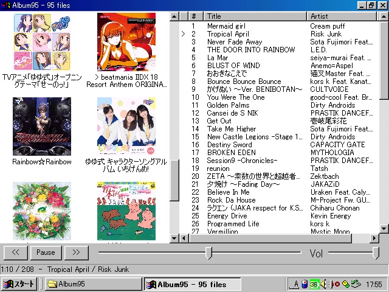

# album95

album95 is a lightweight album-oriented music player for Windows 95 and later.

It is designed for old PCs and classic Windows environments, focusing on fast album browsing and simple playback.

The player is intentionally minimal and compatible with very old Windows systems.



---

## Features

- Album-based music browsing
- AAC / M4A playback (BASS + BASS_AAC)
- Album artwork extraction from `covr` tags
- Album list with cover thumbnails
- Track list with metadata
- Double-click albums or tracks to play
- Seek bar and volume control
- Status bar with playback information
- UTF-8 metadata support (converted to the system ANSI code page)
- Various Artists album detection
- Disc / track number sorting
- Filename fallback parsing (`1-07 title.m4a`)
- Cover artwork BMP cache
- INI configuration file
- Optional 32 kHz playback mode
- Windows 95 compatible build

---

## System Requirements

- Windows 95 or later
- MMX Pentium 150 MHz or faster recommended
- 32 MB RAM or more

---

## Music Folder

By default, album95 scans the following folder:

```
C:\Music
```

You can change the music folder by holding **Shift while launching the program**.

When starting with **Shift held**, album95 will allow you to:

- Choose a different music folder
- Select the output sample rate (44.1 kHz or 32 kHz)

Settings are stored in:

```
album95.ini
```

Example:

```
[General]
MusicRoot=C:\Music
SampleRate=44100
```


---

## Build

A `Makefile` is included.

Tested build environment:

- MinGW g++
- `-std=gnu++98`
- Windows 95 compatible build settings

Example toolchain:

```
MinGW GCC 6.x
```


---

## BASS Dependency

album95 uses the **BASS audio library** by Un4seen for audio playback.

https://www.un4seen.com/

This project currently targets BASS 2.2.

The repository does **not include BASS binaries**.

Required runtime files:

```
bass.dll
bass_aac.dll
```


These must be obtained from the official BASS distribution.

The MinGW import library (`libbass.a`) can be generated from the DLL if necessary.

---

## Character Encoding

album95 reads metadata as UTF-8 and converts it to the current Windows ANSI code page.

This allows metadata to display correctly on different language versions of Windows.

Characters not supported by the system code page may appear as `?`.

---

## License

MIT License

---

## Credits

Audio playback powered by **BASS**  
https://www.un4seen.com/

This software includes stb_image by Sean Barrett.
https://github.com/nothings/stb

Parts of the source code were developed with assistance from ChatGPT.